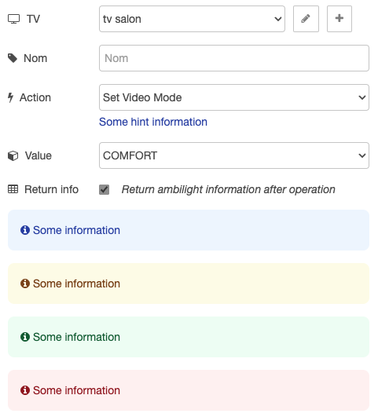

# HTML Template

Some classes are available to help you to create a beautiful template.



## Available Classes

### `.dx-form-row`

Help you to create a row in the form. But something more beautiful.

#### Examples

```html
<div class="dx-form-row">
    <div class="main">
        <div>
            <i class="fa fa-tag"></i>
            <label for="node-input-name" data-i18n="name"></label>
        </div>
        <input type="text" id="node-input-name" data-i18n="[placeholder]name"/>
    </div>
</div>
```

```html
<div class="dx-form-row">
    <div class="main">
        <div>
            <i class="fa fa-bolt"></i>
            <label for="node-input-action">Action</label>
        </div>
        <select id="node-input-action">
            <option value="mute">Mute</option>
            <option value="volumeup">Volume Up</option>
            <option value="volumedown">Volume Down</option>
            <option value="power">Power</option>
        </select>
    </div>
    <div class="hint">Some hint information</div>
</div>
```

##### Hints

You have access to the following classes to style the hint:

- `.hint`
- `.hint-info`
- `.hint-warning`
- `.hint-danger`
- `.hint-success`

### `.alert`

Create a beautiful alert box.

#### Examples

```html
<div class="alert alert-info">
    <i class="fa fa-info-circle"></i>
    <span>Some information</span>
</div>
```

You have access to the following classes to style the alert:

- `.alert-info`
- `.alert-warning`
- `.alert-danger`
- `.alert-success`
